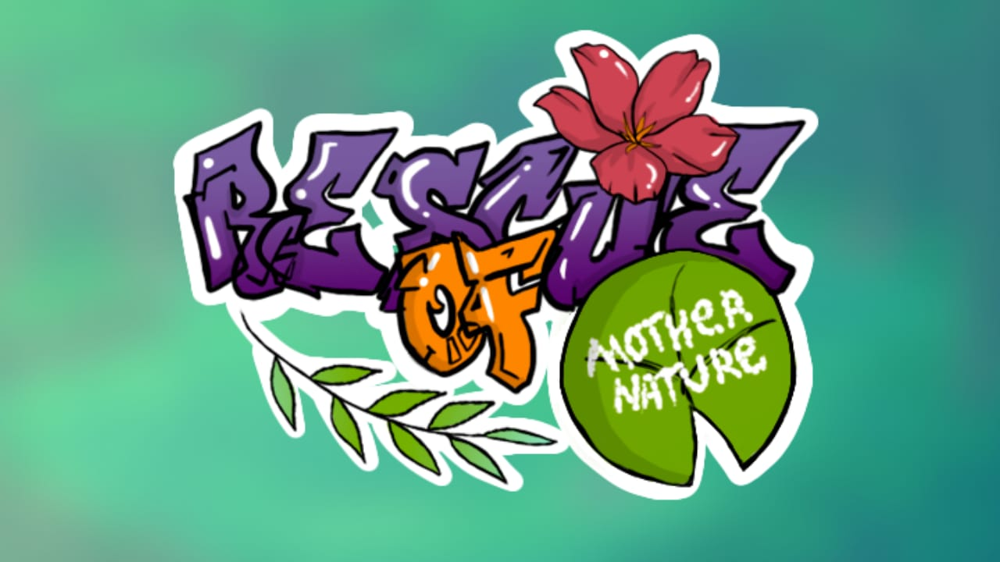

# Rescue Of Mother Nature

# 🌱 Sustainable Beat 'Em Up – 2D Game Project

## 🎮 About the Project | Sobre o Projeto

### 🇺🇸 English

During the Digital Game Development course at SENAI, I developed a 2D beat ’em up game focused on environmental awareness in Brazil.

The project was conceived as an experience that integrates narrative, mechanics, and social purpose, using games as a tool for environmental education and engagement.

The story follows two protagonists, Ajax and Azalea, who are sent on a mission to save the Earth from pollution. The development process began with conceptual definition, followed by the creation of a Game Design Document (GDD), storyboard, narrative structure, and level progression planning.

The project was fully developed from scratch — including concept, visual identity, assets, animations, cutscenes, level design, and part of the programming.

---

### 🇧🇷 Português

Durante o curso de Desenvolvimento de Jogos Digitais no SENAI, desenvolvi um jogo 2D no estilo beat ’em up com temática voltada à sustentabilidade no Brasil.

O projeto foi concebido como uma experiência que integra narrativa, mecânica e propósito social, utilizando o jogo como ferramenta de conscientização ambiental.

A história acompanha os personagens Ajax e Azalea, que recebem a missão de salvar a Terra da poluição. O desenvolvimento iniciou pela definição conceitual, passando pela criação do Game Design Document (GDD), storyboard, estrutura narrativa e planejamento da progressão das fases.

O projeto foi desenvolvido integralmente do zero — desde o conceito até os assets visuais, animações, cutscenes, level design e parte da programação.

---

# 🛠 Technologies & Tools | Tecnologias e Ferramentas

- Unity (Game Engine)
- C# (Gameplay Programming)
- Aseprite (2D Pixel Art & Animations)
- Adobe Photoshop (Visual Identity & Additional Art)
- Trello (Agile Organization & Sprint Planning)
- Miro (Level Design & Ideation Mapping)

---

# 🎨 Full Visual Production | Produção Visual Completa

All visual elements were manually created from scratch, including:

- Main characters  
- Enemies and Boss  
- Environment and backgrounds  
- UI screens and transition screens  
- Cutscenes  
- Complete animation states (walk, punch, defense, enemy behaviors)  
- Visual identity and art direction  

This process strengthened my understanding of:

- Visual feedback  
- Screen readability  
- Gameplay rhythm  
- Animation timing  
- Visual hierarchy in 2D environments  

---

# 🧠 Design & Documentation Process | Processo de Design e Documentação

## Documentation Produced

- Game Design Document (GDD)
- Storyboard
- Level progression structure
- Narrative design
- Gameplay rules definition

## Skills Applied

- Systems thinking
- UX for games
- Gameplay balancing
- Narrative alignment with mechanics
- Level flow and player progression design

The project reinforced my ability to structure digital products considering documentation, user experience, visual identity, and technical execution as parts of a unified system.

---

# 💻 Technical Contributions | Contribuições Técnicas

In addition to the artistic and conceptual direction, I was responsible for:

- Implementation of gameplay mechanics in C#
- Character movement system
- Combat interactions
- Enemy behavior logic
- Scene organization and structure inside Unity
- Basic state control for animations

---

# 🎯 Project Purpose | Propósito do Projeto

This project was not only about building a game — it was a complete exercise in:

- Game Design  
- Visual Production  
- Interactive Experience Design  
- Agile Organization  
- Technical Implementation  

It represents my ability to independently conceive, design, structure, and execute a digital product from concept to playable prototype.

---

# 🚀 Key Competencies Demonstrated | Competências Demonstradas

- 2D Game Development
- Beat ’Em Up Mechanics
- Pixel Art Production
- Animation Design
- UX for Games
- Narrative Design
- Agile Workflow
- Technical Problem Solving
- End-to-End Project Ownership

---

# 📌 Future Improvements

- Combat polish and balancing
- Sound design expansion
- Additional enemy types
- Environmental interaction system
- Performance optimization

---

# 👩‍💻 Author

Developed by Letícia de Castro  
Digital Game Development Student  
Focused on Game Design, Interactive Experience and Technical Implementation
